# 基于SpringBoot与Uni-app的校园互助系统的设计与实现（计科版）

> 公开脱敏版：保留论文正文与技术插图；学校模板、页眉页脚、校徽、身份元数据不进入公开文件，含个人资料或凭据的截图已隐藏。

目 录

## 绪论

### 选题背景

首先，现有的社交应用虽然在一定程度上满足了学生们的社交需求，但由于缺乏专门性，其中包含的信息多为琐碎、不够关注校园实际生活。因此，设计一个以校园为中心的综合性互助系统成为了当务之急。这个系统将提供一个集成多功能的平台，包括但不限于校园资讯、失物招领、二手交易、活动组织等，以满足大学生在校园中各种需求的同时，也能促进校园社交和交流。

其次，大学生在校园中有着丰富多样的需求，包括物品交流、情感表达、吐槽校园生活等。传统社交应用往往无法满足这些特殊需求，因而需要一个专注于校园生活的平台，以提高信息的准确性和可信度。本系统将提供专门的校园社区功能，让学生们能够更便捷地分享校园生活中的点点滴滴，并获得更多的帮助和支持。

最后，面对日益增加的信息安全问题，用户的隐私和个人信息保护亟待解决。本系统将采用现代安全技术，如JWT安全访问控制，以确保用户信息的保密性和系统的稳定性。同时，系统还将加强对用户数据的保护和加密，以防止未经授权的访问和泄露。

在这一背景下，基于Spring Boot与Uni-app的校园互助系统的设计与实现成为了一项迫切而重要的课题，旨在为大学生创造一个更为便捷、安全、互动性强的校园生活社交平台。通过整合校园生活中各种功能和服务，为学生们提供一个全方位、高效率的互助平台，促进校园社交和信息共享，进一步丰富和便利大学生的校园生活。

### 国内外发展现状

在国内外，随着互联网技术的不断发展，校园互助系统逐渐成为学生们社交和信息获取的重要平台。在国内，诸如“校园拼团”、“二手市场”等功能的校园互助系统层出不穷，以满足学生的实际需求。这些系统通过强调本地性和实用性，使得信息更加贴近学生生活，成为大学生日常不可或缺的社交工具。

国内的校园互助系统多以满足学生的实际需求为主要目标。比如，学生们可以在这些平台上发布自己的二手物品，寻找室友，组织校园活动等。这些功能都极大地方便了学生们的日常生活，提升了他们的社交活动效率。

在国外，类似的校园社交平台也逐渐兴起，如美国的“CollegeConfidential”和欧洲的“StuDocu”。这些平台不仅提供了二手物品买卖和情感交流的功能，还结合了学业辅助和课程资源共享，为学生们提供了更为全面的服务。在这些平台上，学生们可以互相分享学习经验，提供课程资料和笔记，进行学科讨论等。这种多功能性的校园互助系统为学生们的学习和生活提供了更多的支持和帮助。

无论是国内还是国外的校园互助系统，都倾向于采用先进的云计算和大数据技术，以实现更高效的信息管理和服务分发。同时，注重用户体验，引入了人工智能和自然语言处理等技术，提升了系统的智能化水平。例如，通过大数据分析，系统可以根据用户的兴趣和需求推荐相关的信息和活动；而利用自然语言处理技术，系统可以更加智能地理解用户的查询和需求，并给出更准确的答复和建议。

总体而言，国内外校园互助系统在不断推陈出新，致力于提供更全面、智能的服务。这些系统成为学生们日常生活的重要组成部分，为校园社交和信息共享提供了便捷而丰富的平台。随着技术的不断进步和用户需求的不断变化，相信这些校园互助系统将会继续发挥重要作用，为学生们创造更加丰富多彩的校园生活。

### 目的与意义

本毕业设计的目的在于构建基于Spring Boot与Uni-app的校园互助系统，以满足大学生日益多元化的社交和信息需求。通过整合发布闲置、表白、吐槽等功能，系统旨在促进校内信息共享、增强社交互动，提高校园生活的便捷性和趣味性。

这一系统的设计具有深远的意义。首先，通过提供集成性的校园生活服务平台，促进了校内信息的全面流通，为学生提供了更为便捷的社交体验。其次，通过实现点赞、收藏、评论等交互功能，培养了学生们分享和合作的习惯，促进了校园社交的积极发展。此外，通过引入JWT安全访问控制等现代技术，保障了用户信息的安全性，为大学生提供一个可信赖的社交平台。

总体而言，本设计旨在为大学生提供一个全面、安全、高效的校园互助系统，以促进校园社交，改善学生生活体验，具有积极的社会价值和实际应用前景。

## 关键技术介绍

### 关键性开发技术介绍

#### Spring Boot

Spring Boot是Spring框架的进化产物，以其约定大于配置的理念，极大地简化了Spring框架的配置繁琐性。通过引入Spring Boot Starter和结合Maven工具，开发人员能够迅速搭建起整合了Spring、Spring MVC、MyBatis等框架的系统，形成一套高效的SSM框架。

它就像一把魔法钥匙，能够以惊人的速度解锁开发过程中的诸多烦扰。Spring Boot通过一系列默认配置，让开发者可以不再为琐碎的配置而烦恼，而是专注于业务逻辑的实现。它的独特之处在于不仅仅提供了快速搭建的能力，还通过内置Tomcat服务器的方式，使得整个开发过程更加轻松，不再需要额外的服务器配置和部署步骤。

#### Vue与Uni-app

在校园互助系统的前端开发中，我们选择采用Vue框架，充分利用其简单、灵活的特点。通过Vue，我们能够构建出响应式、高效的用户界面，实现了系统页面的动态更新和交互。组件化的设计思想让我们可以将页面拆分为独立的组件，提高了代码的可维护性和复用性。Vue框架在系统前端的应用，为用户提供了流畅的操作体验。

基于Spring Boot与Uni-app的校园互助系统具备跨平台的需求，Uni-app成为我们的首选。UNI-app允许我们使用一套代码，同时在多个平台上运行，如微信小程序、H5、App等。这种跨平台的特性为开发者提供了极大的便利，减少了开发成本和维护工作。通过Uni-app，我们成功地实现了在不同平台上保持一致性的用户体验，为用户提供了更加便捷和统一的使用方式。

综上所述，Vue框架和Uni-app在校园互助系统的设计与实现中发挥了关键作用，为系统的前端开发提供了强大的支持，同时实现了跨平台的愿景，为用户提供了高效、一致的使用体验。

#### MySQL数据库

MySQL是一种开源的关系型数据库管理系统（RDBMS），由瑞典MySQL AB公司开发，现为Oracle公司旗下产品。MySQL以其高性能、可靠性和开放源代码的特点而闻名。它支持多种操作系统，包括Windows、Linux和Mac OS，同时提供了丰富的SQL语法和功能，使其成为广泛应用于Web开发、企业级应用等领域的数据库选择。

在基于Spring Boot与Uni-app的校园互助系统中，MySQL是我们选择的主要数据库。它被用于存储用户信息、发布的内容、评论数据等关键信息。通过使用MySQL，我们能够建立起高效、可扩展的数据库结构，确保系统能够存储和检索大量数据。MySQL的事务管理和数据完整性保障了系统在并发操作和数据操作方面的稳定性，为系统提供了可靠的数据支持。

#### MyBatis-Plus

MyBatis-Plus（简称MP）是MyBatis框架的增强工具包，为MyBatis提供了更多实用的功能和便捷的操作。它简化了MyBatis的使用流程，提供了更多方便的注解和API，支持代码生成、分页查询、性能分析等功能。MyBatis-Plus旨在提高开发效率，减少重复代码，使得MyBatis的使用更加简单和便捷。

在基于Spring Boot与Uni-app的校园互助系统中，我们采用了MyBatis-Plus作为持久层框架。它大大简化了数据库操作的代码，通过代码生成工具，能够自动生成实体类、Mapper接口和XML映射文件，减轻了开发者的重复工作。同时，MyBatis-Plus提供了强大的查询构建器，支持链式调用，使得复杂的查询变得更加简单和直观。

MyBatis-Plus还提供了基于注解的CRUD操作，极大地减少了SQL语句的编写，提高了开发效率。其内置的分页插件支持灵活的分页查询，为系统中的数据分页展示提供了良好的支持。

### 其它相关技术

HTTP（Hypertext Transfer Protocol）是一种用于传输超文本的协议，是Web上数据通信的基础。它基于请求-响应模型，客户端通过发送HTTP请求向服务器请求资源，服务器通过HTTP响应返回请求的资源。HTTP通常运行在TCP协议之上，使用URL作为统一资源定位符来标识资源。HTTP请求方法包括GET、POST、PUT、DELETE等，而请求头和请求体则包含了传输的详细信息。

在基于Spring Boot与Uni-app的校园互助系统中，HTTP请求是系统与前端、其他服务之间进行信息交互的关键手段。通过HTTP请求，前端可以向后端发送各种类型的请求，如获取数据、提交表单、上传文件等。系统后端则通过HTTP响应返回相应的结果，实现前后端的数据交流。

## 系统分析

### 功能性需求分析

（1）发布功能：

发布闲置： 用户能够发布自己不需要的物品信息，包括物品描述、价格、联系方式等。

发布表白： 用户可表达对他人的喜欢或感激之情，包括文字、图片等形式。

发布吐槽： 用户可发布对校园生活、社会热点等的吐槽和看法，实现情感宣泄。

个人发布信息管理：用户可以删除个人发布的信息。

（2）互动功能：

点赞： 用户能够对其他用户发布的内容进行点赞，增加交互和社交氛围。

收藏： 用户可收藏自己感兴趣的内容，方便后续查看。

评论： 用户能够对其他用户的内容进行评论，进行实时互动。

评论回复： 实现对评论的回复功能，提高交流的深度和广度。

（3）后台管理功能：

用户管理： 后台管理员能够管理用户信息，包括用户权限、封禁用户等。

内容管理： 管理发布的闲置、表白、吐槽等内容，包括审核、删除等操作。

评论管理： 管理用户评论，实现审核、删除等功能。

内容黑名单管理：添加黑名单，自动过滤带有辱骂，侮辱等敏感词汇。

（4）系统管理功能：

日志查询： 系统管理员能够查询系统运行日志，监控系统运行状态。

（5）其他基础功能：

登录： 用户通过注册后可登录系统，确保信息安全和个性化使用。

注册： 新用户能够注册系统账户，提供个人信息和安全凭证。

信息浏览：可以浏览App中所有信息。

通过以上功能需求分析，系统能够实现多样化的校园生活服务，提供了用户发布、互动、管理等全方位的功能，以满足用户多元化的需求。后台管理功能和系统管理功能则保障了系统的稳定运行和安全性。

#### App用户用例描述

A pp用户在本系统中统称为前台用户，前台用户主要使用App上的功能：发布功能、互动功能、其他基础功能，其中发布功能与互动功能需要App用户登录才可以使用，用例图如图3.1所示。

图3.1 前台用户用例图

其他基础功能中的注册、登录用例描述如表3.1所示，主要介绍前台登录与注册流程和条件。

表3.1 注册登录

<table>
<tr><td>用例名称</td><td>注册与登录</td></tr>
<tr><td>参与者</td><td>前台用户</td></tr>
<tr><td>描述</td><td>输入基本信息进行账号注册（姓名，账号，密码，头像（可选）） 注册成功后，输入账号密码进行登录，系统服务端自动记录日志</td></tr>
<tr><td>前置条件</td><td>无</td></tr>
<tr><td>后置条件</td><td>无</td></tr>
<tr><td>事件流</td><td>输入基本信息 系统对基本信息进行验证，验证通过后，提示前台用户注册成功，验证失败，提示前台用户失败信息 进行登录，输入账号与密码 系统对账号与密码进行验证，查询是否有此人，验证通过，登录成功跳转App首页，验证失败，提示失败信息</td></tr>
</table>

发布功能用例描述如表3.2所示，阐述了发布功能中三个模块需要的字段信息与基本的发布流程。

表3.2 发布功能

<table>
<tr><td>用例名称</td><td>发布功能</td></tr>
<tr><td>参与者</td><td>前台用户</td></tr>
<tr><td>描述</td><td>登录过的用户，可以进行表白，吐槽，闲置出售，物品寻找等信息的发布，发布成功后，其他用户可以在App相关页面进行查看，服务端记录日志</td></tr>
<tr><td>前置条件</td><td>前台用户成功登入系统</td></tr>
<tr><td>后置条件</td><td>无</td></tr>
<tr><td>事件流</td><td>点击首页发布按钮 选择发布的类型 输入基本信息（标题，内容，联系方式，其他内容，图片（可选）） 点击发布，如果系统检测该用户未登录，提示请登录，并跳转到登录界面，系统服务端自动过滤辱骂等词汇，并替换成*，如果是被封禁的用户无法发布内容 发布成功，可以在个人中心查看自己发布的内容</td></tr>
</table>

互动功能用例描述如表3.3所示，登录过的用户可以对其他用户发布的内容进行点赞，收藏，评论，也可以进行取消收藏，点赞，评论删除等操作。

表3.3 互动功能

<table>
<tr><td>用例名称</td><td>互动功能</td></tr>
<tr><td>参与者</td><td>前台用户</td></tr>
<tr><td>描述</td><td>登录过的用户，可以点赞，收藏，评论其他用户发布的内容，并可以操作自己点赞，收藏，评论的数据，进行删除取消操作</td></tr>
<tr><td>前置条件</td><td>前台用户成功登入系统</td></tr>
<tr><td>后置条件</td><td>无</td></tr>
<tr><td>事件流</td><td>点击他人发布的信息，进行查看 进行点赞，收藏，评论操作，如果系统检测该用户未登录，提示请登录，并跳转到登录界面 操作成功，界面数据刷新，系统生成该用户的操作记录（点赞记录，收藏记录，评论记录），如果用户进行评论操作，系统服务端自动过滤辱骂等词汇，并替换成*，如果是被封禁的用户无法评论内容 用户可以在个人中心操作自己收藏，点赞，评论的数据，进行删除取消操作</td></tr>
</table>

其他基础功能中的个人信息编辑用例如表3.4所示，登录过的用户可以进行个人密码、昵称修改，头像替换等操作。

表3.4 个人信息编辑

<table>
<tr><td>用例名称</td><td>其他基础功能-个人信息编辑</td></tr>
<tr><td>参与者</td><td>前台用户</td></tr>
<tr><td>描述</td><td>修改个人基本信息，修改成功，App通知用户重新登录</td></tr>
<tr><td>前置条件</td><td>前台用户成功登入系统</td></tr>
<tr><td>后置条件</td><td>无</td></tr>
<tr><td>事件流</td><td>个人中心点击个人头像，查看个人基本信息，如果用户未登录，App提示用户登录，并跳转登录界面 修改昵称，密码，替换头像，如果修改了昵称，系统服务端自动过滤辱骂等词汇，并替换成* 点击修改 修改成功，重新登录</td></tr>
</table>

#### 后台管理系统用例描述

后台用户主要进行数据管理操作，比如人工审核App中的数据信息，删除敏感内容，人工审核评论内容，删除不符合要求的评论内容，对App用户进行封禁操作，查询所有用户的操作记录（系统操作日志浏览），进行敏感词的设置，来保证系统生态环境的稳定和谐，用例图如图3.2所示。

图3.2 后台用户用例图

App用户管理用例图描述如表3.5所示，后台用户可以进行昵称模糊查询，分页查询，并可以查看该App用户的发帖与评论内容，且可以对内容进行删除，后台用户还可以对App用户进行封禁与解封操作。

表3.5 App用户管理

<table>
<tr><td>用例名称</td><td>App用户管理</td></tr>
<tr><td>参与者</td><td>后台用户</td></tr>
<tr><td>描述</td><td>分页，名字模糊查询App用户；查看单个App用户的发布内容（评论与内容数据）；封禁，解封App用户</td></tr>
<tr><td>前置条件</td><td>后台用户通过账号与密码登入系统</td></tr>
<tr><td>后置条件</td><td>无</td></tr>
<tr><td>事件流</td><td>在App用户管理界面，输入App用户昵称选择分页参数进行App用户查询 选择步骤1结果的某一列，查看该用户发布的内容信息，并删除不符合规定的内容数据 对该用户进行封禁操作，如果是封禁状态则可以进行解封操作</td></tr>
</table>

内容/评论/日志管理业务流程一致，内容管理用例描述如表3.6所示，后台用户能够对内容数据进行模糊查询，可以删除不合时宜的内容，具体如表3.6所示。

表3.6 内容管理

<table>
<tr><td>用例名称</td><td>内容管理</td></tr>
<tr><td>参与者</td><td>后台用户</td></tr>
<tr><td>描述</td><td>查询所有App中的内容，删除不合规定的内容</td></tr>
<tr><td>前置条件</td><td>后台用户登入系统</td></tr>
<tr><td>后置条件</td><td>无</td></tr>
<tr><td>事件流</td><td>对内容进行信息模糊查询与分页查询 删除不合规定的内容</td></tr>
</table>

后台用户可以增加，删除，修改，启用系统中的所有敏感词，来保证系统整体环境干净，具体如表3.7所示。

表3.7 敏感词管理

<table>
<tr><td>用例名称</td><td>敏感词管理</td></tr>
<tr><td>参与者</td><td>后台用户</td></tr>
<tr><td>描述</td><td>增加，删除，修改敏感词内容，启用、不启用敏感词</td></tr>
<tr><td>前置条件</td><td>后台用户登入系统</td></tr>
<tr><td>后置条件</td><td>无</td></tr>
<tr><td>事件流</td><td>点击敏感词管理 进行敏感词内容模糊查询，启用、不启用精确查询，分页查询 修改删除敏感词 增加敏感词 结束</td></tr>
</table>

### 非功能性需求分析

（1）性能需求：

响应时间： 系统应保证在高并发情况下，页面响应时间不超过3秒。

并发用户数： 支持至少1000名同时在线用户。

数据处理速度： 系统应在处理大量数据时保持较高的处理速度，例如，查询、排序、过滤等操作。

（2）可靠性需求：

系统稳定性： 系统应能在连续运行30天的情况下，无崩溃或重大故障。

故障恢复： 在系统发生故障时，能够迅速进行恢复，并且不会造成数据丢失。

（3）安全性需求：

数据隐私： 用户个人信息应得到有效的保护，采用加密技术确保数据在传输和存储过程中的安全。

身份验证与授权： 系统应具备安全的用户身份验证机制，并基于用户角色进行合理的授权管理。

防止恶意攻击： 系统应具备防范常见网络攻击（如SQL注入、XSS攻击）的能力。

（4）可维护性需求：

代码结构： 采用模块化的代码结构，便于新增功能和维护。

文档： 提供详细的技术文档，包括系统架构、数据库设计、接口文档等，以便未来维护人员理解和修改系统。

（5）易用性需求：

界面友好： Uni-app前端应设计简洁、直观、易用的用户界面，符合用户体验设计原则。

操作简便： 提供简单的操作流程，降低用户学习成本，确保用户可以轻松使用系统功能。

（6）可扩展性需求：

新功能扩展： 系统设计应具备良好的扩展性，能够方便地集成和部署新的功能模块。

系统规模扩展： 系统应能够方便地通过水平或垂直扩展，以适应不断增长的用户规模。

### 可行性分析

（1）技术可行性：本系统的服务端采用Java作为编程语言，搭建于Spring Boot框架之上，同时整合了Uni-app框架作为前端支持。这一技术组合为开发者提供了高效的开发体验，Spring Boot的简化配置和Uni-app的跨平台特性使得系统的开发更为便捷。数据库方面选用MySQL，为常见的关系型数据库，提供了稳定的数据存储支持。整体而言，所选技术栈的封装和易用性为系统的技术可行性提供了有力支持。

（2）经济可行性：系统的开发环境基于常见的Windows环境，所使用的开发框架和技术都是免费提供给学生使用的。这降低了系统开发所需的经济投入，使得整个开发过程更加经济可行。此外，Spring Boot和Uni-app等技术都有强大的开发社区支持，可以在解决问题和获取帮助的过程中减少额外的经济负担。

（3）市场可行性：基于SpringBoot与Uni-app的校园互助系统在市场上有其独特的优势。与现有的校园互助系统相比，本系统结合了Spring Boot的后端支持和Uni-app的跨平台特性，为用户提供了更为灵活和便捷的使用体验。系统的互助功能，结合Uni-app的多端一体化开发，旨在满足校园用户对于互帮互助的需求。市场上目前尚未有类似的系统，因此本系统在市场上具有一定的创新性和竞争优势，有望引起积极的市场反响。

## 系统设计

### 架构设计

（1）前端架构：

Uni-app与Vue：采用Uni-app框架构建跨平台的前端应用，其中Vue作为主要的前端开发框架，确保在不同平台上保持一致的用户体验。

界面构建：使用Uni-app构建App界面，同时采用Vue构建Web端界面。为了提高界面美观性和用户体验，整合colorUI与ELM UI进行界面构造。

数据交互：通过Axios与Ajax进行前后端的数据交互，支持主要的HTTP请求类型，包括POST与GET。

（2）后端架构：

Spring Boot框架：作为服务端的主要开发框架，提供快速搭建与开发的优势，支持RESTful API的开发。

SSM架构：使用Spring、Spring MVC和MyBatis-plus的组合，实现了系统的业务逻辑、控制层和持久层的分离。

全局异常与返回处理：实现全局异常处理机制，确保系统在面对异常情况时能够友好地向前端返回响应。

数据交互与事务处理：利用ORM框架进行数据库操作，确保数据的一致性。采用声明式事务机制，保证用户操作的原子性。

全局日志：使用AOP进行全局操作日志记录，并使用异步函数，将操作记录存入DB。

（3）数据库：

MySQL数据库： 作为主要的数据存储方案，存储内容，用户，点赞，评论，收藏，敏感词等基本信息。设计规范化的数据库结构以支持系统的扩展与维护。

（4）数据流与交互：

HTTP请求： 前端通过HTTP请求向后端API请求数据，包括用户信息、互助服务信息等。

后端处理： 后端接收到请求后，进行相应的业务处理，通过MyBatis-Plus与MySQL数据库交互，实现数据的增删改查。

Response返回： 后端将处理结果通过HTTP Response返回给前端，确保前后端之间的有效数据流。

（5）安全性与扩展性：

安全性考虑： 在系统设计中加入安全性考虑，包括对用户身份的验证、数据的加密传输等，以保障用户信息的安全。

扩展性： 为了支持系统的扩展，设计模块化的架构，便于新增功能模块和适应未来的需求变化，系统架构图如图4.1所示。

图4.1 系统架构图

功能模块组成图如图4.2所示。

图4.2 功能结构图

### 功能设计

#### App用户登录注册

App用户登录注册用到2个核心方法。

userRegister方法： 接收前端传递的用户注册信息，使用@RequestBody注解将请求体映射为User对象。调用dataVerify.verify(user)方法进行用户数据的验证。如果用户的头像地址为空字符串，将其设置为默认头像地址。调用userService.save(user)方法保存用户信息。verify方法：该方法用于验证用户的账号（number）是否已存在于数据库中，如果存在则抛出ResultException异常，提示账号已被注册。如果账号不存在，则对用户的密码进行MD5加密，提高密码的安全性，时序图如图4.3所示。

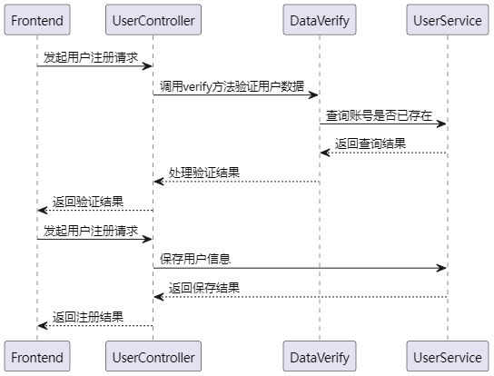

图4.3 注册时序图

userLoginDto方法：通过@PostMapping("/login")注解，该方法接收前端传递的用户登录信息，使用@RequestBody注解将请求体映射为User对象。调用userService.login(user)方法进行用户登录，并返回一个封装了用户信息和签名的UserLoginDto对象。login方法：该方法是实际执行用户登录的逻辑。调用MyBatis的selectOne方法，通过账号和经过MD5加密的密码在数据库中查询用户信息。如果查询结果为null，表示账号和密码不匹配，抛出ResultException异常，提示账号或密码错误。如果查询结果不为null，表示登录成功，返回一个封装了用户信息和签名的UserLoginDto对象，登录时序图如图4.4所示。

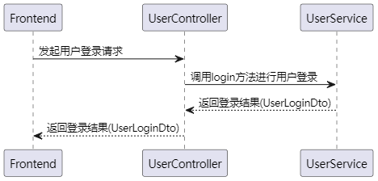

图4.4 用户登录时序图

#### App发布功能

creatConfess方法（控制器）：通过@PostMapping("/creatConfess")注解，该方法接收前端传递的Confess对象，使用@RequestBody注解将请求体映射为Confess对象。使用@isLogin注解确保用户已登录，只有登录用户才能发布内容。使用@CheckInfo注解进行额外的信息检查，检查发布的内容是否带有敏感词汇，使用@SystemLog注解进行操作日志记录，调用confessService.creatConfess(confess)方法，将内容创建的请求委托给服务层进行处理。creatConfess方法（服务层）：接收前端传递的Confess对象，进行必要的业务逻辑处理。将内容信息转化为JSON字符串并存储在Confess对象中。获取当前登录用户的ID，设置内容的发布者。设置发布时间为当前时间。如果图片列表不为空，将图片列表转化为字符串，并存储在Confess对象中。使用MyBatis的insert方法将Confess对象插入数据库，时序图如图4.5所示。

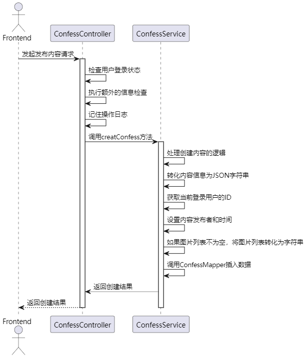

图4.5 内容发布时序图

#### App互动功能

通过@PostMapping("/add")注解，该方法接收前端传递的Like对象，使用@RequestBody注解将请求体映射为Like对象。使用@isLogin注解确保用户已登录，只有登录用户才能点赞。使用@SystemLog(info = "点赞")注解记录点赞操作的日志。查询用户是否已点赞过相同的目标（pkId），如果已点赞，则抛出ResultException异常（LIKE_AGAIN）。如果未点赞过，则设置点赞的用户ID、当前时间，然后调用likeService.save(like)保存点赞记录，点赞时序图如图4.6所示。

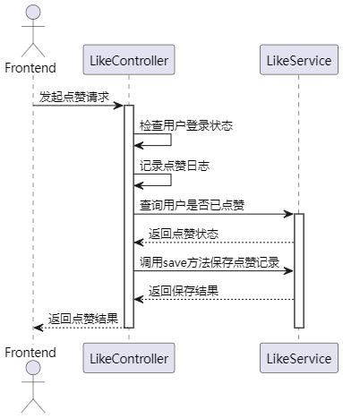

图4.6 点赞时序图

通过@PostMapping("/add")注解，该方法接收前端传递的Collect对象，使用@RequestBody注解将请求体映射为Collect对象。使用@isLogin注解确保用户已登录，只有登录用户才能收藏。使用@SystemLog(info = "收藏")注解记录收藏操作的日志。查询用户是否已收藏过相同的目标（pkId），如果已收藏，则抛出ResultException异常（COLLECT_AGAIN）。如果未收藏过，则设置收藏的用户ID、当前时间，然后调用collectService.save(collect)保存收藏记录，收藏时序图如图4.7所示。

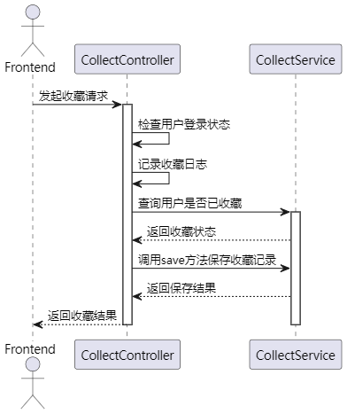

图4.7 收藏时序图

通过@PostMapping("/add")注解，该方法接收前端传递的Comment对象，使用@RequestBody注解将请求体映射为Comment对象。使用@isLogin注解确保用户已登录，只有登录用户才能进行评论。使用@SystemLog(info = "评论")注解记录评论操作的日志。如果Comment对象的id属性不为空，表示这是一条回复，需要更新原评论的回复时间和回复内容。如果id为空，表示这是一条新评论，设置评论的用户ID、当前时间。调用commentService.saveOrUpdate(comment)保存或更新评论记录，评论时序图如图4.8所示。

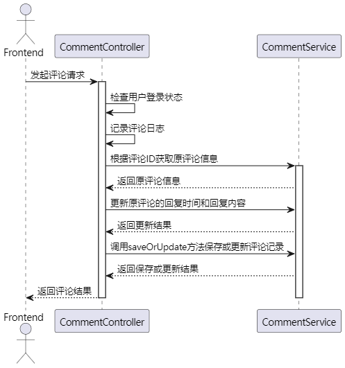

图4.8 评论时序图

#### 后台内容列表获取功能

通过@PostMapping("/list")注解，该方法接收前端传递的SearchVto对象，使用@RequestBody注解将请求体映射为SearchVto对象。使用@isLogin注解确保用户已登录，只有登录用户才能获取发布内容列表。使用@BackUse注解，帮助拦截器区分，该接口只允许后台用户访问。使用@SystemLog(info = "获取所有发布内容")注解记录获取发布内容的操作日志。构建查询条件，根据搜索关键字（likeString）模糊查询标题，根据类型（type）筛选。调用confessService.page方法分页查询符合条件的发布内容。遍历查询结果，对每个发布内容进行处理：将图片字符串转化为图片列表。将内容信息字符串转化为Map对象。查询发布用户信息。查询点赞、评论、收藏数量。设置总记录数。返回分页结果，内容查询时序图如图4.9所示。

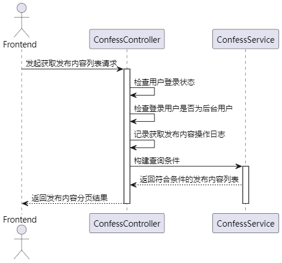

图4.9 内容列表获取

#### 后台敏感词列表获取，增加功能

通过@PostMapping("/sensitive")注解，该方法接收前端传递的SearchVto对象，使用@RequestBody注解将请求体映射为SearchVto对象。使用@BackUse注解表示此接口只能够让后台用户访问。使用@isLogin注解确保用户已登录，只有登录用户才能获取敏感词信息。使用@SystemLog(info = "获取所有敏感词信息")注解记录获取敏感词信息的操作日志。构建查询条件，根据搜索关键字（likeString）模糊查询敏感词信息和敏感词编号。调用sensitiveMapper.selectPage方法分页查询符合条件的敏感词信息，查询时序图如图4.10所示。

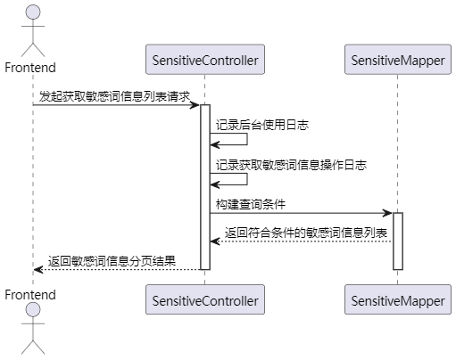

图4.10 敏感词列表获取时序图

通过@PostMapping("/addsensitive")注解，该方法接收前端传递的Sensitive对象，使用@RequestBody注解将请求体映射为Sensitive对象。使用@BackUse注解表示此接口只能够让后台用户访问。使用@isLogin注解确保用户已登录，只有登录用户才能添加或修改敏感词信息。使用@SystemLog(info = "添加修改敏感词信息")注解记录添加或修改敏感词信息的操作日志。如果Sensitive对象的id属性为空，表示这是一条新敏感词，调用sensitiveMapper.insert(sensitive)添加敏感词信息。如果id不为空，表示这是一条已存在的敏感词，调用sensitiveMapper.updateById(sensitive)修改敏感词信息，时序图如图4.11所示。

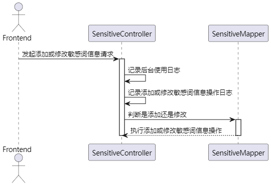

图4.11 敏感词增加或者修改时序图

#### 日志记录功能

日志记录的实现过程为AOP切面实现，在上述功能设计描述中，出现了非常多的@SystemLog注解，这个注解就是日志记录切面注解，设计实现过程如下：前置通知（systemLogBefore）：记录操作开始信息，包括开始时间、接口内容、请求地址、类名方法等。解析请求参数，排除不需要记录的参数类型（如ServletRequest、ServletResponse、MultipartFile）。获取用户信息，判断是否登录，并记录操作用户。构建Log对象，表示操作日志。异常通知（systemLogFail）：在目标方法抛出异常时执行，记录异常信息。设置日志状态为“失败”。插入异常日志到数据库。后置通知 - 正常返回（systemLogSuccess）：在目标方法正常返回时执行，记录成功信息。设置日志状态为“成功”。插入成功日志到数据库。日志插入数据库：使用LogMapper将构建的Log对象插入数据库，持久化操作日志，时序图如图4.12所示，登录拦截，敏感词拦截的实现方式与日志记录一致。

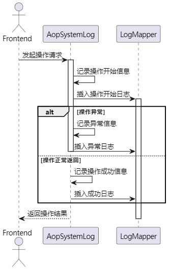

图4.12 日志记录时序图

#### 后台统一删除

del 方法为后台统一删除接口，接口接收前端传递的 SearchVto 对象，根据其中的 delType 字段的值来确定要删除的信息类型。具体解释如下：

如果delType 为0，表示删除评论，调用commentService.removeById() 删除指定评论。

如果 delType 为 1，表示删除发布内容，首先调用 confessService.removeById(id) 删除发布内容，然后通过 collectService、commentService、likeService 分别删除与该内容相关的收藏、评论、点赞记录。

如果 delType 为 2，表示删除后台用户，如果删除的用户是当前登录的后台用户，抛出异常，否则调用 adminService.removeById() 删除指定后台用户。

如果 delType 不是上述情况，表示删除敏感词，调用 sensitiveMapper.deleteById() 删除指定敏感词。

方法使用了事务注解 @Transactional，保证在整个删除过程中，如果发生异常，则进行回滚。同时，通过 @SystemLog 注解记录了操作日志，其中 info 属性表示日志信息为“后台删除信息”，时序图如图4.13所示。

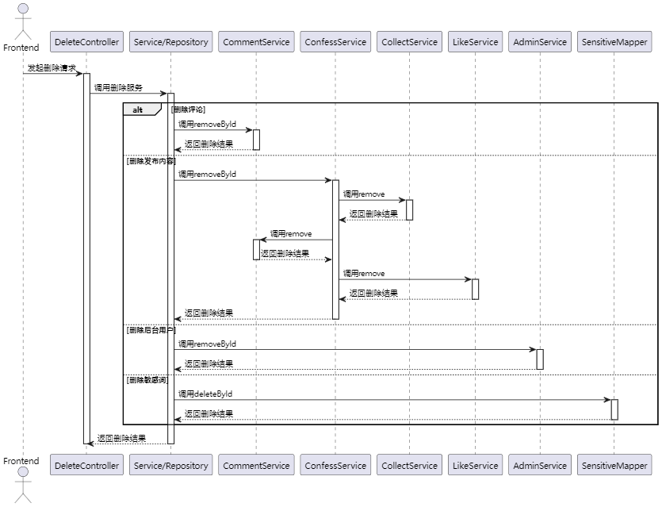

图4.13 统一删除时序图

### 数据库设计

#### E-R图设计

根据上述功能流程设计，可以得知本系统有8个实体类，也就是8张表：用户表，后台用户表，收藏表，评论表，内容表，点赞表，日志表，敏感词内容表，其中用户表与收藏，评论，内容，点赞为一对多关系，内容与收藏，评论，点赞为一对多关系，评论表为自关联关系，显示评论内容与评论的回复内容，数据库E-R图如图4.14所示。

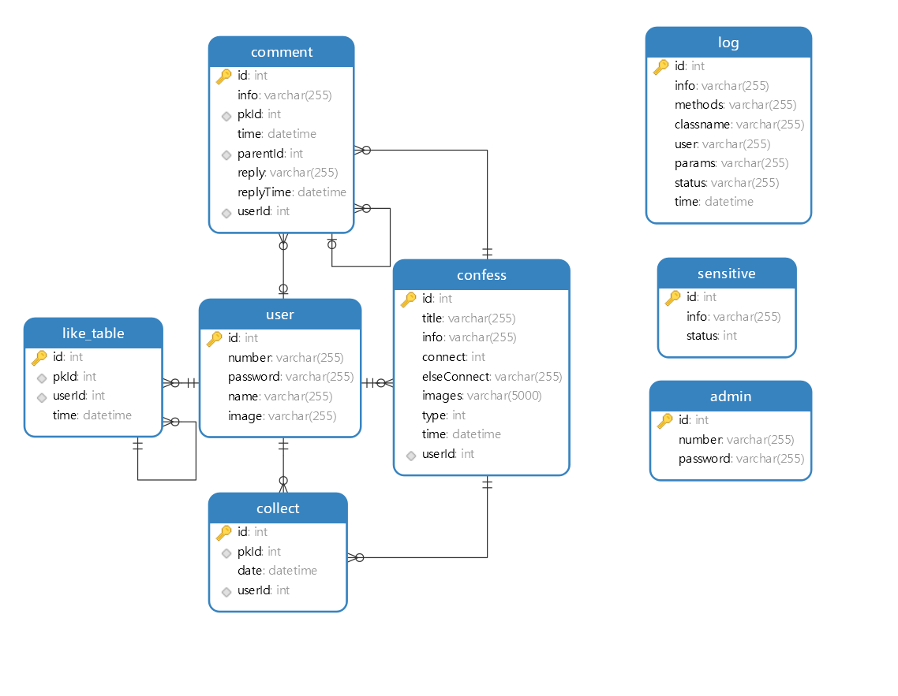

图4.14 E-R图

#### 数据库表设计

用户表主要字段为number，password与status，number与password是登录注册中的校验字段，status表示该用户是否可以发布与评论内容，具体如表4.1所示

表4.1 用户表

<table>
<tr><td>字段名</td><td>数据类型</td><td>主键/允许空</td><td>字段含义</td></tr>
<tr><td>id</td><td>int</td><td>PRIMARY KEY</td><td>主键</td></tr>
<tr><td>number</td><td>varchar(255)</td><td>NOT NULL</td><td>登录账号</td></tr>
<tr><td>password</td><td>varchar(255)</td><td>NOT NULL</td><td>登录密码</td></tr>
<tr><td>name</td><td>varchar(255)</td><td>NOT NULL</td><td>姓名</td></tr>
<tr><td>image</td><td>varchar(255)</td><td>NOT NULL</td><td>头像</td></tr>
<tr><td>status</td><td>int</td><td>NOT NULL</td><td>0封禁1不封禁</td></tr>
</table>

内容表主要字段为info，存储的为jsonstring，表示内容的详细信息数据，userId字段关联用户表，系统可以通过这个字段获取该用户发布的所有内容，具体如表4.2所示。

表4.2 内容表

<table>
<tr><td>字段名</td><td>数据类型</td><td>主键/允许空</td><td>字段含义</td></tr>
<tr><td>id</td><td>int</td><td>PRIMARY KEY</td><td>主键</td></tr>
<tr><td>title</td><td>varchar(255)</td><td>NOT NULL</td><td>表白</td></tr>
<tr><td>info</td><td>varchar(255)</td><td>NOT NULL</td><td>内容（json string)</td></tr>
<tr><td>connect</td><td>int</td><td>NOT NULL</td><td>0手机1qq2微信3其他</td></tr>
<tr><td>elseConnect</td><td>varchar(255)</td><td>NULL</td><td>其他</td></tr>
<tr><td>images</td><td>varchar(5000)</td><td>NULL</td><td>图片</td></tr>
<tr><td>type</td><td>int</td><td>NOT NULL</td><td>（0表白1闲置2寻物3吐槽）</td></tr>
<tr><td>time</td><td>datetime</td><td>NOT NULL</td><td>发布时间</td></tr>
<tr><td>userId</td><td>int</td><td>NOT NULL</td><td>发布人</td></tr>
</table>

收藏表主要字段为userId表示收藏的用户是谁，pkId表示收藏的内容是什么，具体如表4.3所示。

表4.3 收藏表

<table>
<tr><td>字段名</td><td>数据类型</td><td>主键/允许空</td><td>字段含义</td></tr>
<tr><td>id</td><td>int</td><td>PRIMARY KEY</td><td>主键</td></tr>
<tr><td>pkId</td><td>int</td><td>NOT NULL</td><td>外键</td></tr>
<tr><td>date</td><td>datetime</td><td>NOT NULL</td><td>收藏时间</td></tr>
<tr><td>userId</td><td>int</td><td>NOT NULL</td><td>收藏人</td></tr>
</table>

评论表主要字段为id与parentId，这两个字段形成评论与回复的树形关系，userId表示评论人与回复人，info表示评论内容，pkId表示被评论的内容，具体的表结构如表4.4所示。

表4.4 收藏表

<table>
<tr><td>字段名</td><td>数据类型</td><td>主键/允许空</td><td>字段含义</td></tr>
<tr><td>id</td><td>int</td><td>PRIMARY KEY</td><td>评论主键</td></tr>
<tr><td>info</td><td>varchar(255)</td><td>NOT NULL</td><td>评论信息</td></tr>
<tr><td>pkId</td><td>int</td><td>NOT NULL</td><td>被评论内容</td></tr>
<tr><td>time</td><td>datetime</td><td>NOT NULL</td><td>评论时间</td></tr>
<tr><td>parentId</td><td>int</td><td>NULL</td><td>父</td></tr>
<tr><td>reply</td><td>varchar(255)</td><td>NULL</td><td>回复内容</td></tr>
<tr><td>replyTime</td><td>datetime</td><td>NULL</td><td>回复时间</td></tr>
<tr><td>userId</td><td>int</td><td>NULL</td><td>用户</td></tr>
</table>

点赞表主要字段为pkId与userId，表示点赞人与点赞的内容，具体如表4.5所示。

表4.5 点赞表

<table>
<tr><td>字段名</td><td>数据类型</td><td>主键/允许空</td><td>字段含义</td></tr>
<tr><td>id</td><td>int</td><td>PRIMARY KEY</td><td>点赞主键</td></tr>
<tr><td>pkId</td><td>int</td><td>NOT NULL</td><td>外键</td></tr>
<tr><td>userId</td><td>int</td><td>NOT NULL</td><td>点赞本人</td></tr>
<tr><td>time</td><td>datetime</td><td>NOT NULL</td><td>点赞时间</td></tr>
</table>

## 系统实现

### 系统开发环境

系统开发环境为Windows11，Java版本为1.8，Node版本为15.6，数据库为阿里云数据库RDS，版本为8.0.23。

系统开发所使用到编译器为WebStorm，IDEA，项目工程文件截图如图5.1所示。

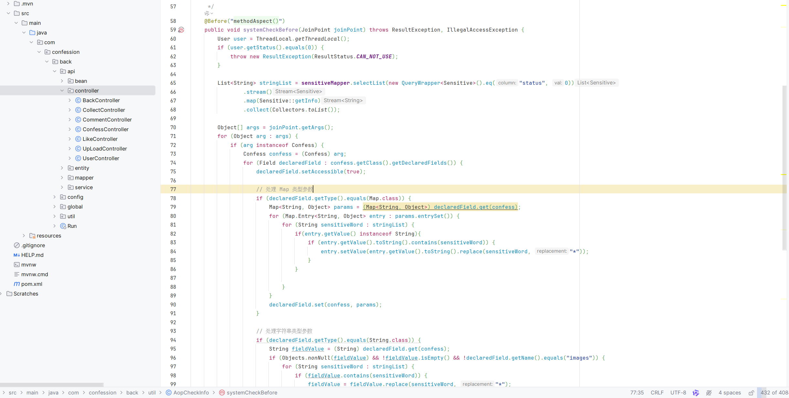

图5.1 项目工程文件

### 前台功能实现

#### App登录注册实现

App注册界面如图5.2所示，整体为一个Form表单，利用Uni-App语法（类Vue）中的双向绑定，展示用户输入的数据，用户输入姓名，登录账号，密码，选择上传的头像，图片上传组件使用了Uni-App的chooseImage组件，用户选择图片后，访问服务端接口upload，服务端通过uploadFile.transferTo(dest);进行文件的保存，所有信息填写完后点击注册按钮，触发Form表单的点击事件，事件中访问服务端的接口: /api/user/register，服务端进行一系列的校验：账号重复性校验，密码加密，并返回相应的标识给前端，前端通过全局请求函数，对服务端返回的code进行判断，如果是200则直接返回给页面，页面跳转到登录界面，如果是其他则使用show函数展示错误或者异常信息。

图5.2 App注册

App登录界面与注册界面一致，使用Vue的双向绑定，获取用户输入的值，然后用户点击登录按钮触发Form表单事件，在事件中通过Promise请求登录接口：/api/user/login，服务端进行校验，校验通过前端使用uni.setStorageSync函数，缓存该登录用户的信息，方便后续接口进行token传输与服务端是否登录判断，然后使用switchTab函数跳转到App首页，界面如图5.3所示。

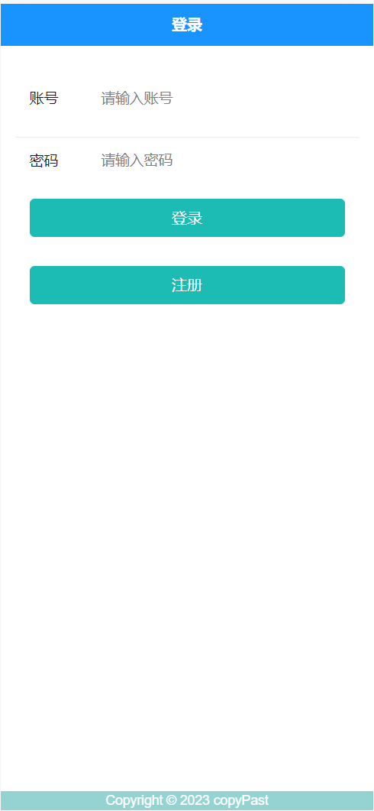

图5.3 App登录

App登录关键代码如下所示：

<table>
<tr><td>public UserLoginDto login(User user) throws ResultException {  User userInfo = userMapper.selectOne(new QueryWrapper&lt;User&gt;().eq(&quot;number&quot;, user.getNumber()).eq(&quot;password&quot;, getMD5(user.getPassword())));  if (userInfo == null) {  throw new ResultException(ResultStatus.ERROR_NUM_PWD);  } else {  return new UserLoginDto(userInfo, sign(userInfo.getNumber(), userInfo.getPassword()));  } }</td></tr>
</table>

代码5.1 App登录

#### 内容浏览与发布

App首页如图5.4所示，底部的Tabbar是对整个系统的内容（表白，寻物，闲置）的一个分类查询，然后每个Tabbar的页面构造都一样，上方是一个查询搜索框，用户可以对内容进行模糊查询，当用户输入查询内容，点击搜索后，App请求服务端接口/api/confess/getList，传入likeString模糊查询参数与type内容类型参数（表白，寻物，闲置），接口返回数据，App使用v-for 语法对接口返回的数据进行循环展示，为了保证App的性能，App对首页数据获取使用了分页，App具有上拉加载与下拉刷新功能，通过nReachBottom函数实现，在该函数中this.totalCount 是总的数据条数，表示在服务端有多少数据。this.confessList.length 是当前已经加载到页面的数据条数。如果总数据条数大于已加载数据条数，说明还有更多数据可以加载。在这种情况下，将状态设置为 'loading'，表示正在加载中，并通过 setTimeout 函数延迟一秒执行加载更多数据的方法。在加载更多数据时，通常会增加页数 this.pageIndex，用于请求下一页的数据。this.getAllConfess() 是执行实际获取数据的方法。如果总数据条数不大于已加载数据条数，说明已经没有更多数据可加载，将状态设置为 'noMore'，表示停止加载。具体代码如下所示。

<table>
<tr><td>nReachBottom() {  if (this.totalCount &gt; this.confessList.length) {  this.status = &#x27;loading&#x27;;  setTimeout(() =&gt; {  this.pageIndex++  this.getAllConfess(); //执行的方法  }, 1000) //这里我是延迟一秒在加载方法有个loading效果，如果接口请求慢的话可以去掉  } else { //停止加载  this.status = &#x27;noMore&#x27;  } }</td></tr>
</table>

代码5.2 数据加载

图5.4 App首页

首页还有一个悬浮按钮，用户点击按钮可以进行内容的发布，悬浮按钮使用了CSS，将控件始终悬停在固定位置，悬浮按钮使用了uni-fab组件，组件中有一个点击事件trigger，用户点击后触发事件，并通过navigateTo函数跳转到发布界面，如图5.4所示，跳转的时候传入参数type，表示发布的类型，在发布界面的onLoad函数中，获取传入的参数，并使用v-if标签进行控制，展示不同的内容，用户输入完所有信息后，点击发布按钮，在addConfess函数中，首先构造一个map对象，将内容存入map对象中，然后请求接口/api/confess/creatConfess，关键代码如下所示。

<table>
<tr><td>public void creatConfess(Confess confess) {  confess.setInfo(JSON.toJSONString(confess.getMap()));  confess.setUserId(ThreadLocal.getThreadLocal().getId());  confess.setTime(new Date());  if (!confess.getImgList().isEmpty()) {  confess.setImages(String.join(&quot;,&quot;, confess.getImgList()));  } else {  confess.setImages(&quot;&quot;);  }  confessMapper.insert(confess); }</td></tr>
</table>

代码5.3 内容发布

在接口中，通过AOP对发布的内容进行敏感词检查与该用户是否被封禁检查，检查通过后，通过insert语句，将数据存入数据库中，然后App收到请求返回，使用跳转函数，将界面跳转至首页，首页自动刷新数据。

图5.5 内容发布

#### 点赞

用户点击每条内容中的点赞按钮，Appi请求服务端接口/api/like/add，点赞关键代码如下所示：

<table>
<tr><td>@PostMapping(&quot;/add&quot;) @isLogin @SystemLog(info = &quot;点赞&quot;) public void addCollect(@RequestBody Like like) throws ResultException {  Integer count = likeService.count(new QueryWrapper&lt;Like&gt;().eq(&quot;pkId&quot;, like.getPkId()).eq(&quot;userId&quot;, ThreadLocal.getThreadLocal().getId()));  if (count &gt; 0) {  throw new ResultException(ResultStatus.LIKE_AGAIN);  } else {  like.setUserId(ThreadLocal.getThreadLocal().getId());  like.setTime(new Date());  likeService.save(like);  } }</td></tr>
</table>

代码5.4 点赞

服务端向点赞表中存入数据，完成点赞，并且App首页刷新，显示该内容的最新点赞数量，然后可以在个人中心我的点赞中查看自己的点赞，左滑可以直接跳转查看内容详情与删除操作，点赞界面如图5.6所示。

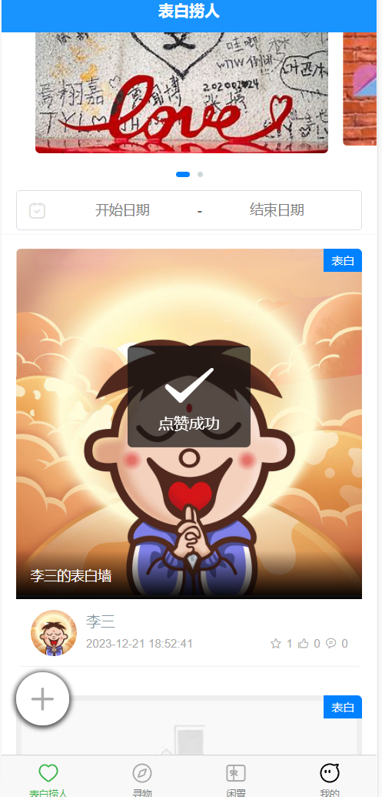

图5.6 点赞

#### 收藏

用户点击每条内容中的收藏按钮，Appi请求服务端接口/api/collect/add，服务端向收藏表中存入数据，完成点赞，并且App首页刷新，显示该内容的最新收藏数量，然后可以在个人中心我的收藏中查看自己的收藏，左滑可以直接跳转查看内容详情与删除操作，点赞界面如图5.7所示。

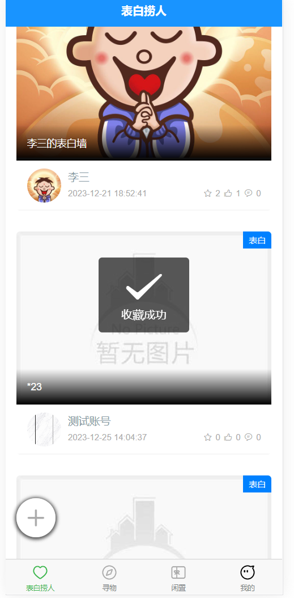

图5.7 收藏

#### 评论与评论回复

用户点击列表中的一列，触发跳转函数detailInfo，并传入该内容的主键，跳转到内容详情界面，该界面以传入的主键为参数请求服务端接口，获取该内容的详细信息与评论信息，然后使用v-for="(comment,index) in commentList"语句对评论内容进行循环渲染展示，如图5.8所示。

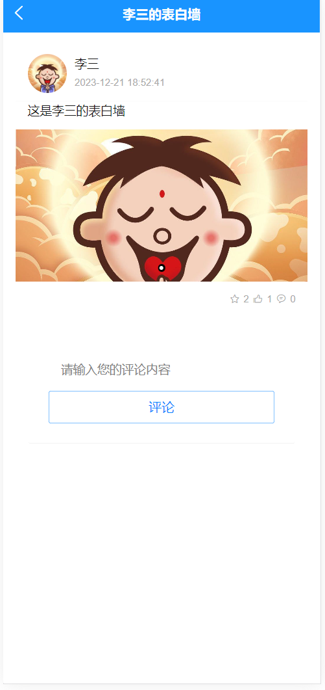

图5.8 内容详情

评论成功后，App自动刷新页面，展示最新的评论信息，并通过评论字段reply与当前登录用户（登录界面缓存数据）与该发布内容用户（userId）的判断，判断是否显回复按钮与删除按钮，用户点击回复按钮，可以回复该评论内容，点击删除按钮，删除该评论，用户也可以在个人中心查看自己的评论内容，并进行删除，如图5.9所示。

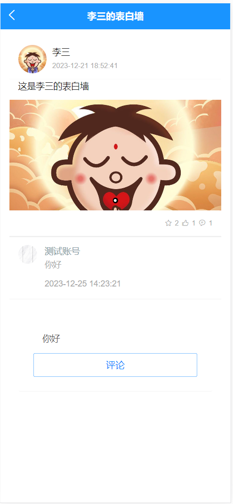

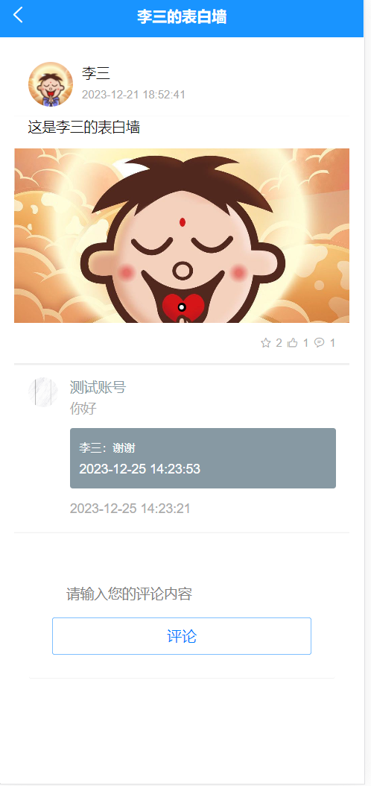

图5.9 评论与回复

#### App个人中心实现

个人中心界面如图5.10所示，用户可以修改个人基本信息，进行退出登录操作，也可以查看个人收藏，点赞，发布，评论的内容，并查看被操作的内容的详细信息与删除。

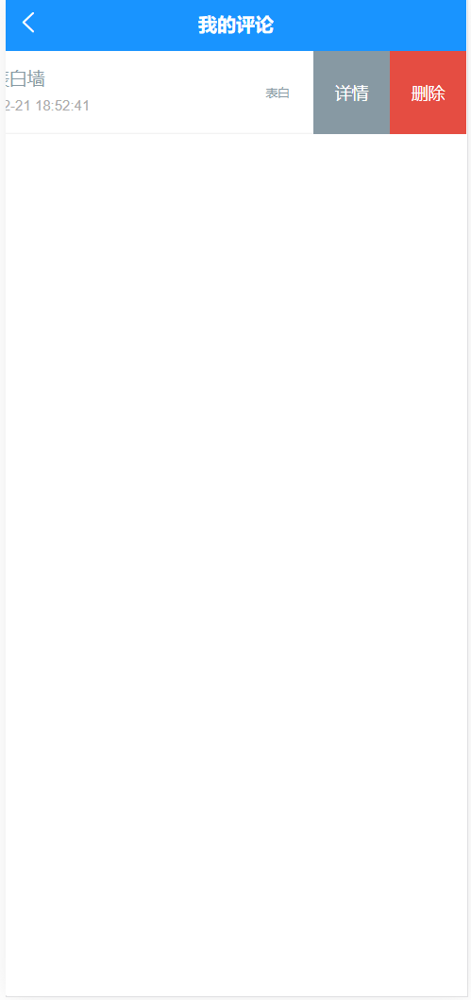

图5.10 个人中心

### 后台管理系统实现

#### 内容管理

内容管理界面如图5.11所示，界面使用了ELM UI 的table组件，前端获取到服务端的数据，然后使用table组件循环展示列表内容，并使用template与el-img组件渲染图片，然后后台用户可以进行内容模糊查询与删除操作，通过Axios请求服务端接口，然后服务端进行delete语句完成数据删除，与like关键字完成模糊查询。

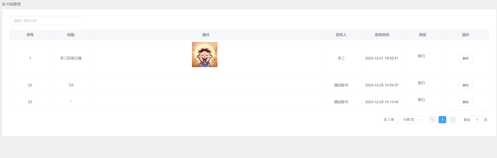

图5.11 内容管理

#### 日志查看

日志界面如图5.12所示，该界面是日志系统可视化，后台用户可以查看本系统中所有用户的操作记录，包括请求的方法，类名，参数，状态等数据，日志的生成使用了AOP。

AopSystemLog 类是一个使用 Spring AOP 实现的系统日志切面类。通过 @Aspect 注解标记为切面类，通过 @Pointcut 注解定义切点，即带有 @SystemLog 注解的方法。在方法执行前记录请求信息，包括请求地址、操作用户、参数等；在方法执行后根据方法的返回结果记录操作状态，并将日志信息插入数据库。如果方法发生异常，则在异常通知中记录异常信息。这样，通过切面，实现了系统日志的自动记录，关键代码如下所示：

<table>
<tr><td>@Before(&quot;methodAspect()&quot;) public void systemLogBefore(JoinPoint joinPoint) {  //开始时间  this.startTimeMillis = System.currentTimeMillis();  ServletRequestAttributes attributes = (ServletRequestAttributes) RequestContextHolder.getRequestAttributes();  HttpServletRequest request = attributes.getRequest();  Signature signature = joinPoint.getSignature();  this.signatureName = signature.getName();  MethodSignature methodSignature = (MethodSignature) joinPoint.getSignature();  Method method = methodSignature.getMethod();  //获取注解的值  SystemLog annotation = method.getAnnotation(SystemLog.class);</td></tr>
</table>

代码5.5 日志记录

然后用户可以进行分页查询，使用了MP的page方法，类似于Select语句的limit，与模糊查看like关键字实现。

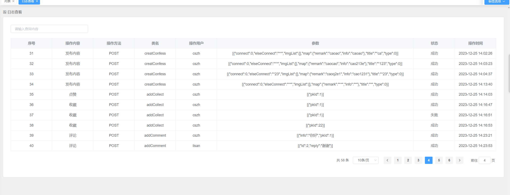

图5.12 日志查看

#### 敏感词管理

敏感词列表如图5.13所示，用户可以进行模糊与分页查询，用户点击增加与修改按钮可以进行敏感词内容的增加与修改操作，增加与修改为同一个Form表单，区分不同的是是否有id的传入，有id为修改，无id为增加，表单受到sensitiveSaveAndUpdate属性控制，如果该属性为true则显示，如图5.12所示，用户输入完后访问接口addsensitive，接口通过id判断，有id访问update方法无id访问add方法。

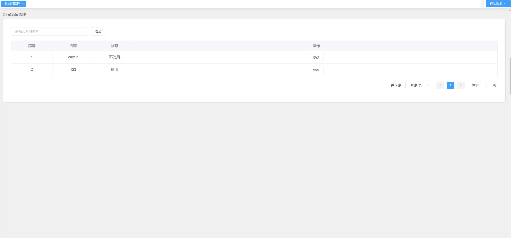

图5.13 敏感词列表

#### App用户管理

App用户列表界面如图5.14所示，用户可以进行模糊与分页查询，然后可以进行封禁操作，封禁与解封的按钮收到v-if控制，通过对用户状态的判断进行显示。

图5.14 App用户管理

用户可以点击查看发布的内容按钮，查看该用户发布的内容，实现方式为将内容管理界面当作组件进行引用，使用el-dialog组件进行控制显示，然后使用组件传值的方式传递用户主键，父组件也就是App用户管理界面通过<home :id="query.id"></home>进行传值，子组件通过props: ['id']与watch进行值得接收与绑定，如图5.15所示。

图5.15 App用户发布内容查看

## 系统测试

### 测试环境与方法

本系统的测试环境为Windows 10操作系统，使用Chrome、Firefox、Edge等主流浏览器进行测试。测试过程中使用的工具包括Postman、IDEAD等。

测试方法采用黑盒测试方法，主要对系统的登录、内容发布、评论与回复等模块进行测试。测试人员按照系统设计的流程，测试系统是否能够正常运行、数据是否准确、用户界面是否友好等方面进行测试。

### 测试用例

#### App功能测试

App登录注册测试用例，主要测试系统是否对账号进行了重复性校验，是否对密码进行了MD5签名处理，是否可以生成Token，是否可以检验账号与密码的一致性，测试结果如表6.1所示。

表6.1 App登录注册测试用例表

<table>
<tr><td>测试序号</td><td>操作描述</td><td>数据</td><td>期望结果</td><td>实际结果</td><td>测试状态</td></tr>
<tr><td>1</td><td>注册账号cs(已存在)</td><td>账号cs，密码123456</td><td>账号存在</td><td>账号存在</td><td>通过</td></tr>
<tr><td>2</td><td>注册账号cs(不存在)</td><td>账号cs，密码123456</td><td>注册成功</td><td>注册成功</td><td>通过</td></tr>
<tr><td>3</td><td>登录账号cs,密码12345</td><td>账号cs,密码12345</td><td>登录失败</td><td>登录失败</td><td>通过</td></tr>
<tr><td>4</td><td>登录账号cs,密码123456</td><td>登录账号cs,密码123456</td><td>登录成功，生成token</td><td>登录成功，生成token</td><td>通过</td></tr>
</table>

内容发布与评论主要测试App是否做了登录拦截，未登录的用户是否可以发布或者评论内容，系统是否做了敏感信息替换，测试结果如表6.2所示。

表6.2 内容发布与评论

<table>
<tr><td>测试序号</td><td>操作描述</td><td>数据</td><td>期望结果</td><td>实际结果</td><td>测试状态</td></tr>
<tr><td>1</td><td>未登录用户进行发布</td><td>发布的内容</td><td>请登录</td><td>请登录</td><td>通过</td></tr>
<tr><td>2</td><td>登录用户发布内容，敏感词为123</td><td>123</td><td>发布的内容为*</td><td>发布的内容为*</td><td>通过</td></tr>
<tr><td>3</td><td>登录用户发布评论，敏感词为123</td><td>123</td><td>发布的内容为*</td><td>发布的内容为*</td><td>通过</td></tr>
</table>

#### 后台管理系统测试

App用户管理主要测试查询，封禁，解封，App用户发布的内容查看功能是否正常，如表6.3所示。

表6.3 App用户管理测试

<table>
<tr><td>测试序号</td><td>操作描述</td><td>数据</td><td>期望结果</td><td>实际结果</td><td>测试状态</td></tr>
<tr><td>1</td><td>查询用户</td><td>用户ID</td><td>显示用户信息</td><td>显示用户信息</td><td>通过</td></tr>
<tr><td>2</td><td>封禁用户</td><td>用户ID</td><td>用户被封禁</td><td>用户被封禁</td><td>通过</td></tr>
<tr><td>3</td><td>解封用户</td><td>用户ID</td><td>用户解封</td><td>用户解封</td><td>通过</td></tr>
<tr><td>4</td><td>查看用户发布的内容</td><td>用户ID</td><td>显示用户发布的内容</td><td>显示用户发布的内容</td><td>通过</td></tr>
</table>

敏感词管理测试如表6.4所示。

表6.4 敏感词管理测试

<table>
<tr><td>测试序号</td><td>操作描述</td><td>数据</td><td>期望结果</td><td>实际结果</td><td>测试状态</td></tr>
<tr><td>1</td><td>增加敏感词</td><td>123</td><td>增加成功</td><td>增加成功</td><td>通过</td></tr>
<tr><td>2</td><td>修改敏感词·</td><td>123</td><td>修改成功</td><td>修改成功</td><td>通过</td></tr>
<tr><td>3</td><td>启用敏感词</td><td>0</td><td>启用成功</td><td>启用成功</td><td>通过</td></tr>
<tr><td>4</td><td>不启用敏感词</td><td>1</td><td>不启用成功</td><td>不启用成功</td><td>通过</td></tr>
</table>

后台登录测试主要测试了后台用户是否按照设计对账号与密码的输入进行验证，具体结果如表6.5所示。

表6.5 登录测试表

<table>
<tr><td>测试序号</td><td>操作描述</td><td>数据</td><td>期望结果</td><td>实际结果</td><td>测试状态</td></tr>
<tr><td>1</td><td>管理员登录</td><td>admin，123456</td><td>登录成功</td><td>登录成功，展示管理员界面</td><td>通过</td></tr>
<tr><td>2</td><td>管理员登录</td><td>Admins,1234</td><td>账号密码错误</td><td>账号密码错误</td><td>通过</td></tr>
</table>

## 结论

综合考虑基于Spring Boot与Uni-app的校园互助系统的设计与实现过程，本项目的成功实施为大学生提供了一个全面的社交平台，有效地促进了校园信息的传递与互动。通过发布闲置、表白、吐槽等功能，系统不仅满足了学生多元化的社交需求，还为校园生活注入了更多的趣味与活力。在技术层面，采用了Spring Boot与Uni-app的组合，既确保了后端系统的稳定性，又赋予了前端更大的灵活性，使得用户体验更为流畅。

通过JWT的引入，系统实现了安全的访问控制，有效保障了用户数据的隐私与安全。这种授权机制为系统提供了高效的用户权限管理，精确控制不同用户的访问权力，增强了整个系统的安全性。在后台管理方面，通过日志查询功能的实现，我们实现了对系统运行状态的实时监控，从而及时发现并解决潜在问题，保障了系统的可靠运行。

总体而言，本设计通过结合先进的后端与前端框架，兼顾了系统的稳定性和灵活性。在功能设计上，系统提供了丰富多彩的社交体验，不仅仅是信息发布，还包括互动特性如点赞、收藏、评论等，使得用户能够更全面地参与校园生活。通过用户管理、内容管理、评论管理等功能，系统实现了对平台内信息的全面管理，提高了系统的稳定性和安全性。

最终，该系统为校园生活提供了一个便捷、多元化的交流平台，极大地改善了校园生活质量。通过这个互助系统，学生们能够更好地分享信息、交流心情，促进了校园社区的建设，为大学生活增添了更多的色彩。在未来，我们将继续关注用户反馈，不断优化系统，以更好地满足学生的需求，为校园社交做出更大的贡献。
